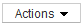

= 여러 자산에 비즈니스 엔티티를 할당하거나 제거합니다
:allow-uri-read: 
:icons: font
:imagesdir: ../media/

[role="lead"]
수동으로 할당하거나 제거할 필요 없이 쿼리를 사용하여 여러 자산에 비즈니스 엔티티를 할당하거나 제거할 수 있습니다.

== 시작하기 전에

원하는 자산에 추가할 비즈니스 엔티티를 이미 만들어야 합니다.

== 단계

. 새 쿼리를 만들거나 기존 쿼리를 엽니다.
. 필요한 경우 비즈니스 엔티티를 추가할 자산을 필터링합니다.
. 목록에서 원하는 자산을 선택하거나 를 클릭합니다 image:../media/select-assets.gif[""] 모두 * 를 선택합니다.
+
작업 * 버튼이 표시됩니다.

. 선택한 자산에 업무 엔티티를 추가하려면 을 클릭합니다 . 선택한 자산 유형에 업무 엔티티가 할당되어 있을 수 있는 경우, [업무 엔티티 추가]에 대한 메뉴 선택이 표시됩니다. 이 옵션을 선택합니다.
. 목록에서 원하는 업무 엔티티를 선택하고 * 저장 * 을 클릭합니다.
+
지정한 새 업무 엔티티는 이미 자산에 할당된 모든 업무 엔티티보다 우선합니다. 자산에 애플리케이션을 할당하면 동일한 방식으로 할당된 비즈니스 엔티티도 무시됩니다. 비즈니스 엔티티를 자산으로 할당하면 해당 자산에 할당된 모든 애플리케이션도 재정의될 수 있습니다.

. 자산에 할당된 업무 엔티티를 제거하려면 를 클릭합니다  을 클릭하고 * 업무 엔티티 제거 * 를 선택합니다.
. 목록에서 원하는 업무 엔티티를 선택하고 * 삭제 * 를 클릭합니다.

