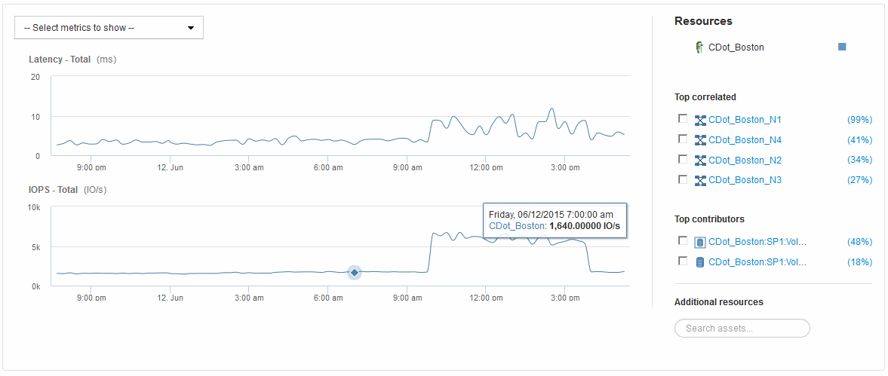

= 전문가 뷰
:allow-uri-read: 
:icons: font
:imagesdir: ../media/

[role="lead"]
자산 페이지의 전문가 보기 섹션에서는 선택한 기간(3시간, 24시간, 3일, 7일, 또는 사용자 지정 기간)을 성능 차트 및 관련 자산에 입력합니다.

다음은 볼륨 자산 페이지의 전문가 보기 섹션의 예입니다.

선택한 기간의 성능 차트에서 확인할 메트릭을 선택할 수 있습니다.

자원 섹션에는 기본 자산의 이름과 성능 차트의 기본 자산을 나타내는 색상이 표시됩니다. 상호 연결된 최상위 섹션에 성능 차트에서 보려는 자산이 없는 경우 추가 리소스 섹션의 * 자산 검색 * 상자를 사용하여 자산을 찾고 성능 차트에 추가할 수 있습니다. 자원을 추가하면 추가 자원 섹션에 나타납니다.

또한 리소스 섹션에 표시된 대로 다음 범주의 기본 자산과 관련된 자산이 있을 수 있습니다.

* 상호 연관성
+
에는 기본 자산에 대한 하나 이상의 성능 메트릭과 높은 상관 관계(백분율)가 있는 자산이 나와 있습니다.

* 최고 기여자
+
기본 자산에 기여하는 자산(백분율)을 표시합니다.

* 탐욕심
+
에는 호스트, 네트워크 및 스토리지와 같은 동일한 리소스를 공유하여 자산에서 시스템 리소스를 빼앗는 자산이 나와 있습니다.

* 성능 저하
+
이 자산으로 인해 시스템 리소스가 고갈된 자산을 표시합니다.

