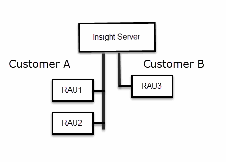

= Insight Security 를 참조하십시오
:allow-uri-read: 
:icons: font
:imagesdir: ../media/

[role="lead"]
OnCommand Insight 7.3.1에서는 향상된 보안으로 Insight 환경을 운영할 수 있는 보안 기능이 도입되었습니다. 암호화, 암호 해싱의 개선, 암호를 암호화하고 해독하는 내부 사용자 암호 및 키 쌍 변경 기능이 포함되어 있습니다. Insight 환경의 모든 서버에서 이러한 기능을 관리할 수 있습니다.

Insight의 기본 설치에는 사용자 환경의 모든 사이트에서 동일한 키와 동일한 기본 암호를 공유하는 보안 구성이 포함됩니다. 중요 데이터를 보호하려면 설치 또는 업그레이드 후에 기본 키와 취득 사용자 암호를 변경하는 것이 좋습니다.

데이터 소스 암호화된 암호는 Insight Server 데이터베이스에 저장됩니다. 서버에 공개 키가 있으며 사용자가 WebUI 데이터 소스 구성 페이지에 암호를 입력할 때 암호를 암호화합니다. 서버에 Server 데이터베이스에 저장된 데이터 소스 암호를 해독하는 데 필요한 개인 키가 없습니다. 획득 장치(Lau, RAU)만 데이터 소스 암호를 해독하는 데 필요한 데이터 소스 개인 키를 가지고 있습니다.

== 서버 키를 다시 입력합니다

기본 키를 사용하면 환경에 보안 취약점이 발생합니다. 기본적으로 데이터 소스 암호는 Insight 데이터베이스에 암호화됩니다. 모든 Insight 설치에 공통적으로 사용되는 키를 사용하여 암호화됩니다. 기본 구성에서 NetApp에 전송된 Insight 데이터베이스에는 이론적으로 NetApp에 의해 암호 해독될 수 있는 암호가 포함되어 있습니다.

== 획득 사용자 암호 변경

기본 '획득' 사용자 암호를 사용하면 환경에 보안 취약점이 발생합니다. 모든 획득 장치는 ""획득" 사용자를 사용하여 서버와 통신합니다. 기본 암호가 있는 RA는 이론적으로 기본 암호를 사용하여 모든 Insight 서버에 연결할 수 있습니다.

== 업그레이드 및 설치 고려 사항

Insight 시스템에 기본 보안 구성이 아닌 구성(암호 키를 다시 입력하거나 변경한 경우)이 포함된 경우 보안 구성을 백업해야 합니다. 새 소프트웨어를 설치하거나 소프트웨어를 업그레이드하는 경우 시스템을 기본 보안 구성으로 되돌립니다. 시스템이 기본 구성으로 복원되면 시스템이 올바르게 작동하려면 기본이 아닌 구성을 복원해야 합니다.

== 복잡한 서비스 공급자 환경에서 키 관리

서비스 공급자는 데이터를 수집하는 여러 OnCommand Insight 고객을 호스팅할 수 있습니다. 이 키는 Insight 서버의 여러 고객이 무단으로 고객 데이터에 액세스하지 못하도록 보호합니다. 각 고객의 데이터는 특정 키 쌍으로 보호됩니다.

이 Insight 구현은 다음 그림과 같이 구성할 수 있습니다.

이 구성에서는 각 고객에 대해 개별 키를 생성해야 합니다. 고객 A는 두 RA 모두에 대해 동일한 키를 필요로 합니다. 고객 B에는 단일 키 세트가 필요합니다.

고객 A의 암호화 키를 변경하는 단계:

. RAU1을 호스팅하는 서버에 원격 로그인을 수행합니다.
. 보안 관리 도구를 시작합니다.
. 기본 키를 대체하려면 암호화 키 변경 을 선택합니다.
. 백업 을 선택하여 보안 구성의 백업 zip 파일을 생성합니다.
. RAU2를 호스팅하는 서버에 원격 로그인을 수행합니다.
. 보안 구성의 백업 zip 파일을 RAU2에 복사합니다.
. 보안 관리 도구를 시작합니다.
. 보안 백업을 RAU1에서 현재 서버로 복원합니다.

고객 B의 암호화 키를 변경하는 단계:

. RAU3을 호스팅하는 서버에 원격 로그인을 수행합니다.
. 보안 관리 도구를 시작합니다.
. 기본 키를 대체하려면 암호화 키 변경 을 선택합니다.
. 백업 을 선택하여 보안 구성의 백업 zip 파일을 생성합니다.

