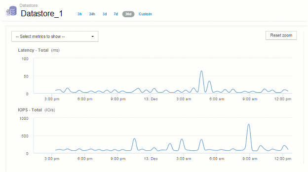

= TTL(Time-to-Live) 및 다운샘플링 데이터
:allow-uri-read: 
:icons: font
:imagesdir: ../media/

[role="lead"]
OnCommand Insight 7.3부터는 데이터 보존 또는 TTL(Time-to-Live)이 7일에서 90일로 증가했습니다. 즉, 차트 및 테이블에 대해 훨씬 더 많은 데이터가 처리되고 수만 개의 데이터 포인트(datapart)가 발생할 가능성이 있기 때문에 데이터가 표시되기 전에 다운샘플링됩니다.

다운샘플링은 차트에서 데이터의 통계적 근사치를 제공하여 수집된 데이터의 정확한 뷰를 유지하면서 모든 데이터 요소를 표시할 필요 없이 데이터를 효율적으로 개괄적으로 보여 줍니다.

== 다운샘플링이 필요한 이유는 무엇입니까?

Insight 7.3은 데이터의 TTL(Time-to-Live)을 90일로 늘립니다. 즉, 차트 및 그래프에 표시할 데이터를 준비하는 데 필요한 처리 양이 증가합니다. 차트를 빠르고 효율적으로 표시할 수 있도록 해당 차트의 모든 데이터 요소를 처리할 필요 없이 차트의 전체 모양을 유지하는 방식으로 데이터가 다운샘플링됩니다.

[NOTE]
====
다운샘플링 중에는 실제 데이터가 손실되지 않습니다. 아래 그림에 표시된 단계를 따르면 다운샘플링된 데이터 대신 차트의 실제 데이터를 볼 수 있습니다.

====

== 다운샘플링의 작동 방식

데이터는 다음 조건에서 다운샘플링됩니다.

* 선택한 시간 범위에 7일 이하의 데이터가 포함된 경우 다운샘플링이 발생하지 않습니다. 차트는 실제 데이터를 표시합니다.
* 선택한 시간 범위에 7일 이상의 데이터가 포함되어 있지만 데이터 요소가 1,000개 미만인 경우 다운샘플링이 발생하지 않습니다. 차트는 실제 데이터를 표시합니다.
* 선택한 시간 범위에 7일 이상의 데이터와 1,000개 이상의 데이터 요소가 포함된 경우 데이터가 다운샘플링됩니다. 차트는 근사화된 데이터를 표시합니다.

다음 예에서는 다운샘플링이 실제 작동 중인 것을 보여 줍니다. 첫 번째 그림에서는 데이터 저장소 자산 페이지의 시간 선택기에서 * 24h * 를 선택하여 24시간 동안 데이터 저장소 자산 페이지에 지연 시간 및 IOPS 차트를 보여 줍니다. 또한 * Custom * 을 선택하고 동일한 24시간 기간으로 시간 범위를 설정하여 동일한 데이터를 볼 수도 있습니다.

7일 미만의 시간 범위를 선택하고 차트에 사용할 데이터 요소가 1,000개 미만인 경우 표시되는 데이터는 실제 데이터입니다. 다운샘플링이 발생하지 않습니다.

image::../media/downsampling-actual-chart.gif[실제 차트 다운샘플링]

그러나 자산 페이지 시간 선택기에서 * 30d * 를 선택하여 데이터를 보는 경우 또는 7일 이상의 사용자 지정 시간 범위를 설정하여(또는 Insight가 선택한 기간 동안 1,000개 이상의 데이터 샘플을 수집한 경우) 데이터가 표시되기 전에 다운샘플링됩니다. 다운샘플링된 차트를 확대하면 디스플레이에 근사화된 데이터가 계속 표시됩니다.

[NOTE]
====
다운샘플링된 차트를 확대할 때 확대/축소는 디지털 확대/축소입니다. 디스플레이에 근사치 데이터가 계속 표시됩니다.

====
다음 그림에서 시간 범위가 처음 30d로 설정된 것을 볼 수 있으며, 그런 다음 차트를 확대하여 위와 동일한 24시간 기간을 표시할 수 있습니다.

다운샘플링된 차트는 위의 "실제" 차트와 동일한 24시간 기간을 보여 주므로 동일한 일반 셰이프를 따라 선이 표시되므로 성능 데이터에서 흥미로운 최고점 또는 최저점을 빠르게 찾을 수 있습니다.

[NOTE]
====
다운샘플링을 위해 데이터가 근사화되기 때문에 다운샘플과 비교할 때 차트 선이 약간 꺼질 수 있습니다 실제 데이터를 사용하여 그래프를 더 잘 정렬할 수 있습니다. 그러나 차이는 크지 않으며 표시되는 데이터의 전체 정확도에는 영향을 미치지 않습니다.

====

== 다운샘플링된 차트에 대한 위반

다운샘플링된 차트를 볼 때는 위반 사항이 표시되지 않는다는 점에 유의하십시오. 위반 사항을 보려면 다음 두 가지 중 하나를 수행합니다.

* 자산 페이지 시간 선택기에서 사용자 정의를 선택하고 7일 미만의 시간 범위를 입력하여 해당 시간 범위의 실제 데이터를 봅니다. 각 빨간색 점 위로 마우스를 가져갑니다. 도구 설명에 발생한 위반이 표시됩니다.
* 시간 범위를 기록하고 위반 대시보드에서 위반 사항을 찾습니다.

