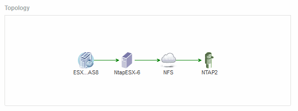

= 토폴로지
:allow-uri-read: 
:icons: font
:imagesdir: ../media/

[role="lead"]
자산에 해당되는 경우 토폴로지 섹션을 통해 기본 자산이 관련 자산에 어떻게 연결되어 있는지 확인할 수 있습니다.

다음은 가상 머신 자산 페이지의 토폴로지 섹션에 표시될 수 있는 항목의 예입니다.

자산의 토폴로지가 섹션에 들어갈 수 있는 것보다 크면 * 토폴로지 * 하이퍼링크를 보기 위한 * 클릭 링크가 대신 표시됩니다.
