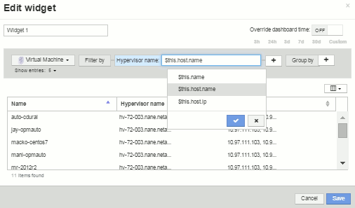

= "$이" 변수 이해
:allow-uri-read: 
:icons: font
:imagesdir: ../media/

[role="lead"]
자산의 "추가 데이터" 사용자 지정 페이지에 있는 특수 변수를 사용하면 현재 자산과 직접 관련된 추가 정보를 쉽게 표시할 수 있습니다.

== 이 작업에 대해

자산의 사용자 지정 가능한 랜딩 페이지의 위젯에 ""$This"" 변수를 사용하려면 다음 단계를 따르십시오. 이 예에서는 테이블 위젯을 추가합니다.

[NOTE]
====
""$This" 변수는 자산의 사용자 지정 가능한 랜딩 페이지에만 유효합니다. 다른 Insight 대시보드에는 사용할 수 없습니다. 사용 가능한 "$This" 변수는 자산 유형에 따라 다릅니다.

====

== 단계

. 선택한 자산에 대한 자산 페이지로 이동합니다. 이 예에서는 가상 머신(VM) 자산 페이지를 선택하겠습니다. VM을 쿼리하거나 검색하고 링크를 클릭하여 해당 VM의 자산 페이지로 이동합니다.
+
VM의 자산 페이지가 열립니다.

. 해당 자산의 사용자 지정 가능한 랜딩 페이지로 이동하려면 * Change view: * > * Additional Virtual Machine data * 드롭다운을 클릭합니다.
. Widget * 버튼을 클릭하고 * Table widget * 을 선택합니다.
+
편집을 위해 테이블 위젯이 열립니다. 기본적으로 모든 스토리지가 테이블에 표시됩니다.

. 모든 가상 시스템을 표시하려고 합니다. 자산 선택기를 클릭하고 * 스토리지 * 를 * 가상 머신 * 으로 변경합니다.
+
이제 모든 가상 머신이 테이블에 표시됩니다.

. 열 선택기 * 버튼을 클릭합니다image:../media/column-picker-button.gif[""]하이퍼바이저 이름 * 필드를 테이블에 추가합니다.
+
하이퍼바이저 이름이 표에 각 VM에 대해 표시됩니다.

. 우리는 현재 VM을 호스팅하는 하이퍼바이저만 신경 쓸 뿐입니다. 필터 기준* 필드의 **+** 버튼을 클릭하고 * 하이퍼바이저 이름 * 을 선택합니다.
. 아무 * 나 * 를 클릭하고 * $this.host.name * 변수를 선택합니다. 확인 버튼을 클릭하여 필터를 저장합니다.
+

. 이제 이 표에는 현재 VM의 하이퍼바이저에 의해 호스팅되는 모든 VM이 표시됩니다. 저장 * 을 클릭합니다.

== 결과

이 가상 머신 자산 페이지에 대해 생성한 테이블이 표시되는 모든 VM 자산 페이지에 대해 표시됩니다. 위젯에서 * $this.host.name * 변수를 사용하면 현재 자산의 하이퍼바이저가 소유한 VM만 테이블에 표시됩니다.
