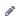

= User Data(사용자 데이터) 섹션을 사용하여 주석을 할당하거나 수정합니다
:allow-uri-read: 
:icons: font
:imagesdir: ../media/

[role="lead"]
회사 요구 사항에 맞는 데이터를 추적하도록 OnCommand Insight를 사용자 지정할 때 _annotations_라는 특수 메모를 정의하여 자산에 할당할 수 있습니다. 자산 페이지의 사용자 데이터 섹션에는 자산에 할당된 주석이 표시되며 해당 자산에 할당된 주석을 변경할 수도 있습니다.

== 단계

. OnCommand Insight 웹 UI에 로그인합니다.
. 다음 중 하나를 수행하여 자산 페이지를 찾습니다.
+
** Insight 도구 모음에서 를 클릭합니다 image:../media/icon-sanscreen-magnifying-glass-gif.gif[""]을 클릭하고 자산 이름을 입력한 다음 목록에서 자산을 선택합니다.
** 대시보드 * 를 클릭하고 * 자산 대시보드 * 를 선택한 다음 자산 이름을 찾아 클릭합니다. 자산 페이지가 표시됩니다.

. 자산 페이지의 * 사용자 데이터 * 섹션에서 를 클릭합니다 image:../media/add-annotation-icon.gif[""].
+
주석 추가 대화 상자가 표시됩니다.

. Annotation(주석) * 을 클릭하고 목록에서 주석을 선택합니다.
. 값 * 을 클릭하고 선택한 주석 유형에 따라 다음 중 하나를 수행합니다.
+
** 주석 유형이 목록, 날짜 또는 부울인 경우 목록에서 값을 선택합니다.
** 주석 유형이 텍스트인 경우 값을 입력합니다.

. 저장 * 을 클릭합니다.
+
주석이 자산에 할당됩니다. 나중에 쿼리를 사용하여 주석을 기준으로 자산을 필터링할 수 있습니다.

. 주석을 지정한 후 주석 값을 변경하려면 을 클릭합니다  다른 값을 선택합니다.
+
주석이 * 주석 지정 시 동적으로 값 추가 * 옵션을 선택한 목록 유형인 경우 기존 값을 선택하는 것 외에도 새 값을 추가하도록 입력할 수 있습니다.

