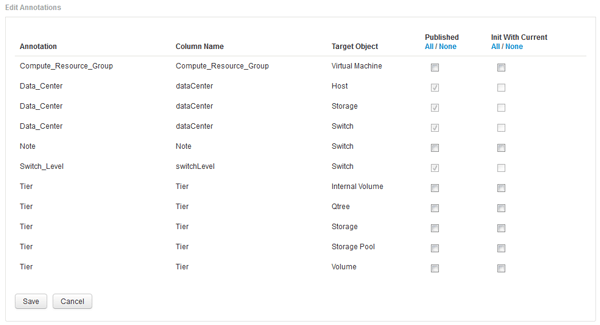

= 사용자 정의 주석을 데이터 웨어하우스로 불러오기
:allow-uri-read: 
:icons: font
:imagesdir: ../media/

[role="lead"]
OnCommand Insight에서 주석 업데이트를 적용한 후 데이터 웨어하우스에서 원하는 주석을 선택하고 데이터 웨어하우스 빌드를 시작해야 합니다. 다음 예약된 빌드가 나올 때까지 기다리거나 지금 빌드를 시작할 수 있습니다.

== 단계

. Data Warehouse Portal( )에 관리자로 로그인합니다 `+https://hostname/dwh+`, 위치 `hostname` OnCommand Insight 데이터 웨어하우스가 설치된 시스템의 이름입니다.
. 왼쪽의 탐색 창에서 * Annotations * 를 클릭합니다.
+
image::../media/oci-dwh-admin-annotations-gif.gif[DWH 주석]

+
이 목록에는 모든 주석 유형에 대한 행과 주석을 지정할 수 있는 대상 객체가 표시됩니다. Published(게시됨) 열의 체크 표시는 특정 대상 개체에 대해 주석이 이미 선택되었으며 Data Warehouse(데이터 웨어하우스) 데이터 마트를 통해 이미 사용 가능함을 나타냅니다.

. OnCommand Insight에서 주석을 가져오는 방법을 편집하려면 * 편집 * 을 클릭합니다.
+

. 주석 프로세스를 편집하려면 다음을 수행합니다.
+
** OnCommand Insight에서 가져온 주석을 데이터 웨어하우스 데이터베이스에 추가하려면 * Published * 를 선택합니다. 모든 개체의 모든 주석을 선택하려면 * All * (모두 *)을 클릭합니다. 모든 옵션을 선택하지 않으려면 * 없음 * 을 클릭합니다.
+
[NOTE]
====
특정 객체의 재고 테이블 및 관련 데이터 마트에서 주석 열을 제거하려면 이 옵션을 선택 취소합니다. 사용자 정의 보고서가 주석 데이터를 사용하는 경우 보고서가 성공적으로 실행되지 않습니다.

====
** 데이터 웨어하우스 차원 테이블의 기록 데이터를 현재 주석 값으로 초기화하려면 * Init with Current * 를 선택합니다. 모든 개체의 모든 주석을 선택하려면 * All * (모두 *)을 클릭합니다. 모든 옵션을 선택하지 않으려면 * 없음 * 을 클릭합니다. 주석을 게시한 후에는 이 확인란을 사용할 수 없으며 게시되지 않은 주석에는 확인란을 사용할 수 있습니다. 예를 들어, 호스트에 주석 유형 ""바닥""이 주석으로 추가되고 호스트_차원 테이블에 해당 호스트에 대한 행 3개가 있는 경우 * 현재 * 와 함께 초기화 를 선택하면 호스트_차원 테이블의 "바닥" 열에 있는 값 ""1""이 연결됩니다. 현재 * 포함 초기화 * 를 선택하지 않으면 해당 호스트의 최신 행만 바닥 열에 ""1"" 값을 갖게 됩니다.

. 저장 * 을 클릭합니다.
+
주석을 제거할 경우 데이터 구조 또는 데이터 손실이 변경된다는 경고 메시지가 나타납니다.

. 계속하려면 * 예 * 를 클릭합니다.
+
데이터 웨어하우스는 요청된 변경 사항을 적용하는 비동기 주석 작업을 시작합니다. 작업 페이지에서 작업을 볼 수 있습니다. 데이터 웨어하우스 데이터베이스 스키마의 변경 사항도 볼 수 있습니다.

