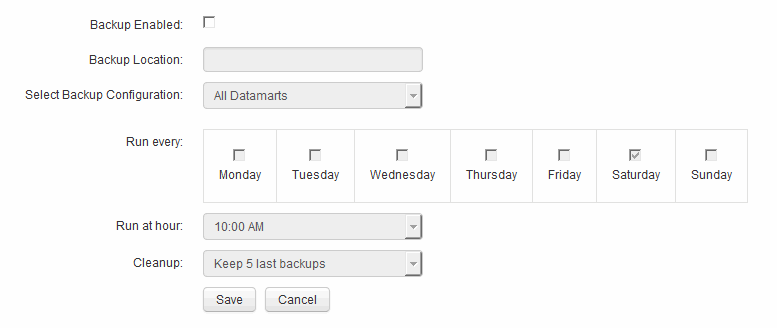

= 일일 백업 예약
:allow-uri-read: 
:icons: font
:imagesdir: ../media/

[role="lead"]
언제든지 백업/복원 컨트롤을 사용하여 데이터 웨어하우스를 수동으로 백업할 수 있지만 데이터 웨어하우스 데이터베이스 및 Cognos 콘텐츠 저장소를 백업할 시기와 빈도를 정의하여 자동 백업을 예약하는 것이 좋습니다. 백업은 데이터 손실로부터 보호하므로 필요한 경우 데이터 웨어하우스 데이터베이스를 복원할 수 있습니다. 또한 새 데이터 웨어하우스 서버로 마이그레이션하거나 새 데이터 웨어하우스 버전으로 업그레이드할 때 백업을 사용합니다.

== 이 작업에 대해

데이터 웨어하우스 서버가 사용 중이 아닌 시간에 백업을 예약하면 백업 성능이 향상되고 사용자에게 미치는 영향이 줄어듭니다.

== 단계

. 에서 데이터 웨어하우스 포털에 로그인합니다 `+https://hostname/dwh+`, 위치 `hostname` OnCommand Insight 데이터 웨어하우스가 설치된 시스템의 이름입니다.
. 왼쪽의 탐색 창에서 * Schedule * 을 클릭합니다.
. 백업 일정 * 대화 상자에서 * 편집 * 을 클릭하여 새 일정을 추가합니다.
+

. 예약된 백업을 활성화하려면 * Backup Enabled * 를 선택합니다.
. 백업 파일을 저장할 위치를 지정합니다.
. 백업할 데이터를 지정합니다.
. 백업을 수행할 요일을 지정합니다.
. 백업을 시작할 시간을 지정합니다.
. 유지할 과거 백업 복사본 수를 지정합니다.
. 저장 * 을 클릭합니다.

