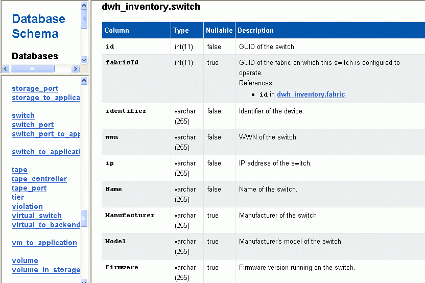

= 데이터베이스 스키마의 주석 변경 표시
:allow-uri-read: 
:icons: font
:imagesdir: ../media/

[role="lead"]
데이터베이스 스키마는 특정 테이블의 변경 사항을 반영합니다.

== 이 작업에 대해

예를 들어 스토리지 배열에 주석을 추가하는 경우 인벤토리 또는 기타 데이터 마트의 스토리지 또는 스위치 테이블에 주석이 표시됩니다.

OnCommand Insight 사용자 인터페이스를 사용하여 리소스의 주석을 업데이트하고 다음 데이터 웨어하우스 빌드를 시작하거나 기다릴 경우 재고(dWh_inventory)의 해당 객체와 해당 차원 테이블에서도 새 열이 추가되거나 제거됩니다 (해당 데이터 마트에서). 결과는 다음 표에 나와 있습니다.

* dWh_inventory.annotation_value 를 입력합니다
* dWh_inventory.object_to_annotation

== 단계

. 을 클릭합니다 image:../media/oci-7-help-icon-gif.gif[""] 데이터 웨어하우스 도구 모음에서 * 문서 * 를 선택합니다.
. 데이터베이스 스키마 * 를 선택합니다.
. 왼쪽의 * 데이터베이스 스키마 * 창에서 * DWH_INVENTORY * 섹션으로 스크롤하여 * SWITCH * 를 클릭합니다.
+

. dWh_inventory.switch * 테이블에는 변경 사항이 반영됩니다.
+
image::../media/oci-dwh-databaseschema-capacity-sd-gif.gif[DWH 용량 데이터베이스 스키마 스토리지 차원 테이블]

+
DataCenter 주석 열이 storage_dimensions 테이블에 나타납니다.

