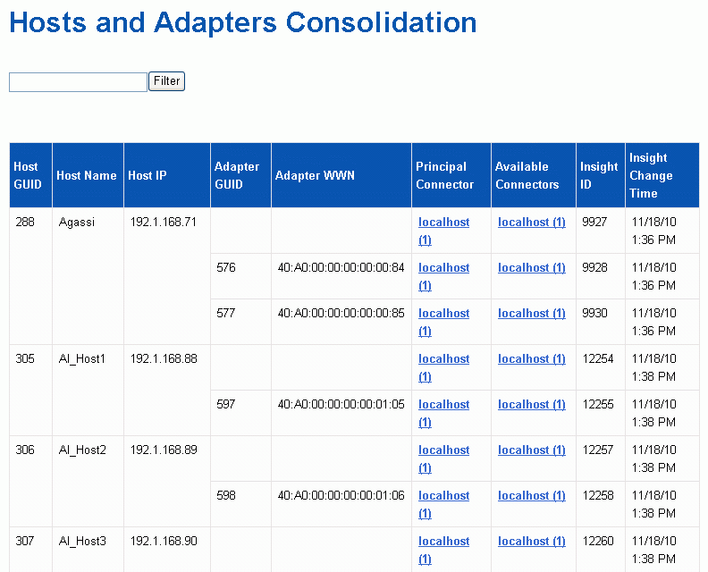

= 호스트 및 어댑터 통합 문제 보기
:allow-uri-read: 
:icons: font
:imagesdir: ../media/

[role="lead"]
호스트 및 관련 어댑터에 대해 보고된 데이터는 Inventory Data Mart에서 파생됩니다.

== 단계

. 에서 데이터 웨어하우스 포털에 로그인합니다 `+https://hostname/dwh+`, 위치 `hostname` OnCommand Insight 데이터 웨어하우스가 설치된 시스템의 이름입니다.
. 왼쪽의 탐색 창에서 * 문제 해결 * 을 클릭합니다.
. 섀시 통합 * 섹션에서 * 호스트 및 어댑터 * 를 클릭합니다.
+
[NOTE]
====
이 예에 표시된 구성은 올바른 구성이 아닙니다. localhost의 보안 및 사용 가능한 커넥터는 Insight 서버와 DWH가 모두 동일한 서버에 설치된다는 것을 의미합니다. 이 예제의 목적은 통합 테이블을 숙지하는 것입니다.

====
+

+
모든 호스트 및 어댑터의 경우 각 커넥터에 대해 보고하는 행과 호스트 및 어댑터가 사용되는 기본 커넥터가 있습니다. 호스트 및 어댑터만 해당, 한 커넥터에서 보고하는 호스트에는 다른 커넥터가 보고하는 어댑터가 있을 수 있습니다.

+
각 커넥터의 호스트/어댑터의 OnCommand Insight 변경 시간도 볼 수 있습니다. 이 매개 변수를 사용하면 호스트/어댑터의 OnCommand Insight에서 업데이트가 발생한 시기와 다른 OnCommand Insight 서버에서 동일한 호스트/어댑터가 업데이트된 시기를 확인할 수 있습니다.

. 필요한 경우 텍스트 부분을 입력하고 * Filter * 를 클릭하여 이 보기의 데이터를 필터링합니다. 필터를 지우려면 * Filter * (필터 *) 상자의 텍스트를 삭제하고 * Filter * (필터 *)를 클릭합니다. 호스트 이름, 호스트 IP, 어댑터 WWN 또는 OnCommand Insight 객체 ID를 기준으로 필터링할 수 있습니다.
+
필터는 대소문자를 구분합니다.

. 다음 데이터를 검토합니다.
+
** 호스트 GUID *
+
이 유형의 통합 장치(호스트)에 대한 글로벌 고유 식별자

** * 호스트 이름 *
+
데이터 웨어하우스에 표시되는 통합 호스트의 이름입니다

** * 호스트 IP *
+
통합 호스트의 IP 주소입니다

** * 어댑터 GUID *
+
호스트 어댑터의 글로벌 고유 식별자입니다

** * 어댑터 WWN *
+
호스트 어댑터의 WWN입니다

** * 주 커넥터 *
+
데이터의 실제 소스인 OnCommand Insight 커넥터의 이름입니다

** * 사용 가능한 커넥터 *
+
통합 호스트/어댑터가 상주하는 모든 OnCommand Insight 커넥터

** * Insight ID *
+
관련 보고 커넥터용 통합 호스트/어댑터의 OnCommand Insight ID입니다

** * Insight 변경 시간 *
+
호스트/어댑터의 OnCommand Insight에서 업데이트가 발생한 경우 및 다른 OnCommand Insight 서버에서 동일한 호스트/어댑터가 업데이트된 경우

. 커넥터에 대한 자세한 내용을 보려면 커넥터를 클릭하십시오.
+
커넥터에 대한 다음 정보를 볼 수 있습니다.

+
** 호스트 이름입니다
** 해당 커넥터에서 데이터 웨어하우스 작업을 마지막으로 실행한 시간입니다
** 해당 커넥터로부터 마지막으로 변경 사항을 수신한 시간입니다
** 해당 커넥터가 가리키는 OnCommand Insight 서버의 버전입니다

