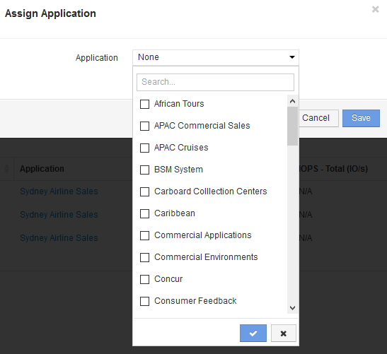

= 쿼리를 사용하여 자산에 응용 프로그램 할당
:allow-uri-read: 
:icons: font
:imagesdir: ../media/

[role="lead"]
애플리케이션에서 사용하는 자산의 리소스를 식별할 수 있도록 자산에 애플리케이션을 할당합니다. 자산에 비용이 할당된 경우 애플리케이션에서 발생한 비용을 식별할 수 있고 리소스가 크기별로 측정되는 경우 리소스를 보충해야 하는지 여부를 결정할 수 있습니다.

== 이 작업에 대해

쿼리를 사용하여 애플리케이션에 여러 자산을 할당하는 작업을 단순화할 수 있습니다.

== 단계

. 새 쿼리를 만들어 응용 프로그램을 할당할 자산을 식별합니다. 예를 들어 지리적 위치와 관련된 특정 이름의 호스트에 할당하려면 * 쿼리 * > * + 새 쿼리 * 를 클릭합니다
. 호스트 * 를 클릭합니다
. 이름 * 필드에 를 입력합니다 `Chicago`
+
시스템에 가 있는 모든 호스트가 표시됩니다 `Chicago` 이름을 입력할 수 있습니다. image:../media/new-query.gif[""]

. 쿼리에서 식별된 호스트 중 하나 이상을 선택합니다.
. Actions * > * Add Application * 을 클릭합니다
+

+
응용 프로그램 할당 대화 상자가 표시됩니다.

. 호스트에 할당할 애플리케이션을 선택하고 를 클릭합니다 image:../media/check-box-ok.gif[""]
. 저장 * 을 클릭합니다
+
응용 프로그램 이름이 사용자 데이터 섹션에 나타납니다.

