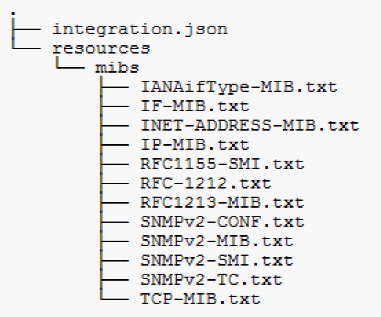

= SNMP 통합 데이터를 수집하는 중입니다
:allow-uri-read: 
:icons: font
:imagesdir: ../media/

[role="lead"]
통합 SNMP 데이터 소스를 사용하면 OnCommand Insight에서 일반 SNMP 데이터를 수집할 수 있습니다.

== 통합 팩

SNMP Integration 데이터 소스는 ""통합 팩""을 사용하여 수집되는 통합 값과 이러한 값을 제공하는 SNMP 개체를 정의합니다.

통합 팩은 다음으로 구성됩니다.

* 특정 장치 유형(스위치, 라우터 등)의 SNMP 개체 측면에서 통합 페이로드 콘텐츠를 정의하는 JSON 구성 파일(integration.json)입니다.
* 통합 팩이 의존하는 MIB 파일 목록입니다.

통합 팩은 여러 데이터 유형을 정의할 수 있습니다. 예를 들어 RHEL 호스트를 통합할 때 가동 시간, 사용자 수, 실행 중인 프로세스 수와 같은 일반 시스템 정보에 대해 데이터 유형을 정의할 수 있으며, 메모리 및 파일 시스템 사용 데이터에 대해 두 번째 데이터 유형을 정의할 수 있습니다. 일반적으로 각 데이터 형식은 ""플랫""이어야 하며 중첩된 데이터를 포함할 수 없습니다.

단일 통합 팩에서 24개 이상의 데이터 유형을 정의해서는 안 됩니다. Insight는 수집되는 통합 데이터의 양을 제한합니다. 1분 동안 24개 이상의 보고서를 수집하려고 시도하면 속도 오류가 발생합니다.

통합 유형의 이름은 다음 규칙을 준수해야 합니다.

* 이름은 _, - 또는, + 문자로 시작할 수 없습니다
* 이름에는 #, \, /, *,?, ",<,>,|,', ',
* UTF-8로 인코딩된 바이트 수가 100개를 초과할 수 없습니다
* 이름을 지정할 수 없습니다. 또는...

== 통합 파일 형식

통합 팩은 SNMP 개체 측면에서 통합 페이로드 콘텐츠를 정의하는 JSON 구성 파일(integration.json)이 포함된 ZIP 파일입니다. 또한 모든 MIB 파일과 해당 MIB 종속성이 포함된 MIBS 폴더도 포함되어 있습니다.

를 클릭합니다 `integration.json` 파일은 ZIP 파일의 최상위 수준에 있어야 하며 MIB 파일은 ZIP 내의 "resources/mibs" 하위 디렉토리에 있어야 합니다. 필요한 경우 ZIP 파일에는 "readme.txt"와 같은 파일도 포함될 수 있습니다. 통합 ZIP 구조의 예는 다음과 같습니다.

