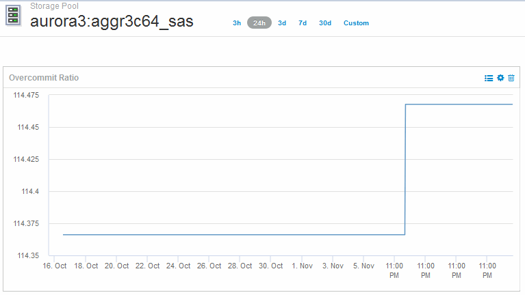

= 대시보드를 생성하여 씬 프로비저닝 환경을 모니터링합니다
:allow-uri-read: 
:icons: font
:imagesdir: ../media/

[role="lead"]
OnCommand Insight의 유연한 대시보드 위젯 설계 및 표시 차트 옵션을 사용하면 용량 사용 및 활용률에 대한 심층 분석, 씬 프로비저닝된 데이터 센터 인프라의 위험을 최소화할 수 있는 전략적 정보를 얻을 수 있습니다.

모니터링할 데이터 저장소 및 스토리지 풀 정보에 대한 액세스를 제공하는 대시보드를 생성할 수 있습니다.

== 대시보드를 사용하여 데이터 저장소 정보에 액세스합니다

가상 인프라에서 모니터링하려는 데이터에 빠르게 액세스할 수 있는 대시보드를 생성할 수 있습니다. 대시보드에는 초과 커밋된 % 및 데이터 저장소의 용량 데이터를 보여 주는 위젯을 기반으로 상위 10개 데이터 저장소를 식별하기 위해 다음과 유사한 위젯이 포함될 수 있습니다. 대시보드는 150% 이상 초과 커밋된 데이터 저장소와 80% 이상의 사용된 용량을 초과한 데이터 저장소를 강조하기 위해 변수를 사용합니다.

image::../media/new-dashboard-thin.gif[새로운 대시보드가 얇습니다]

image::../media/new-dashboard-thin-2.gif[새로운 대시보드 씬 2]

씬 프로비저닝된 환경을 모니터링하는 데 사용할 수 있는 추가 위젯에는 다음 정보 중 일부가 포함될 수 있습니다.

* VMDK 용량은 데이터 저장소와 상호 관련되었습니다
* VM 용량
* 사용된 데이터 저장소 용량 추세

== 대시보드를 사용하여 스토리지 풀 정보를 액세스합니다

대시보드에는 다음과 유사한 위젯이 포함될 수 있으며, 사용된 물리적 스토리지 용량의 양을 식별하거나, 스토리지 풀의 초과 할당 용량을 식별할 수 있습니다.

