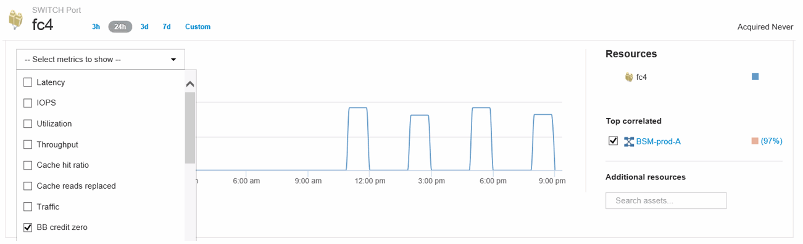

= 포트에 대한 성능 정책 및 임계값 생성
:allow-uri-read: 
:icons: font
:imagesdir: ../media/

[role="lead"]
포트에 연결된 메트릭에 대한 임계값을 사용하여 성능 정책을 생성할 수 있습니다. 기본적으로 성능 정책은 지정된 유형의 모든 디바이스를 생성할 때 적용됩니다. 성능 정책에 특정 장치 또는 장치 집합만 포함하도록 주석을 만들 수 있습니다. 이 절차에서는 간단한 방법으로 주석을 사용하지 않습니다.

== 시작하기 전에

이 성능 정책과 함께 주석을 사용하려면 성능 정책을 만들기 전에 주석을 만들어야 합니다.

== 단계

. Insight 도구 모음에서 * 관리 * > * 성능 정책 * 을 클릭합니다
+
기존 정책이 표시됩니다. 스위치 포트에 대한 정책이 있는 경우 기존 정책을 편집하여 새 정책 및 임계값을 추가할 수 있습니다.

. 기존 포트 정책을 편집하거나 새 포트 정책을 생성합니다
+
** 기존 정책의 맨 오른쪽에 있는 연필 아이콘을 클릭합니다. """ 및 ""e"" 단계에서 설명한 임계값을 추가합니다.
** 새 정책을 추가하려면 * + 추가 * 를 클릭합니다
+
... "정책 이름" 추가: 저속 방전 장치
... 포트를 개체 유형으로 선택합니다
... 의 "'다음 창 적용'에 대한 첫 번째 항목을 입력합니다
... 임계값: BB 크레딧 제로 - Rx > 1,000,000을 입력합니다
... 임계값: BB 크레딧 제로 - Tx > 1,000,000을 입력합니다
... '경고가 생성되면 추가 정책 처리 중'을 클릭합니다.
... "저장"을 클릭합니다.

+
생성하는 정책은 24시간 동안 설정한 임계값을 모니터링합니다. 임계값을 초과하면 위반이 보고됩니다.

. 대시보드 * > * 위반 대시보드 * 를 클릭합니다
+
시스템에서 발생한 모든 위반 사항이 표시됩니다. '저배액기' 위반 사항을 보기 위해 위반 사항을 검색하거나 정렬합니다. 위반 대시보드에는 성능 정책에 설정된 임계값을 초과하는 BB Credit 0 오류가 발생한 모든 포트가 표시됩니다. 위반 대시보드에서 식별된 각 스위치 포트는 포트 랜딩 페이지에 대한 강조 표시된 링크입니다.

. 강조 표시된 포트 링크를 클릭하여 포트 랜딩 페이지를 표시합니다.
+
포트 랜딩 페이지가 표시되며 BB Credit 0 문제 해결에 유용한 정보가 포함되어 있습니다.

+
** 포트가 연결된 장치
** Fibre Channel 스위치 포트인 위반을 보고하는 포트의 ID입니다.
** 포트의 속도입니다
** 연결된 노드 및 포트 이름입니다image:../media/port-landing-page.gif[""]

. 아래로 스크롤하여 포트 메트릭을 확인합니다. 표시할 메트릭 선택 * > * BB 크레딧 없음 * 을 클릭하여 BB 크레딧 그래프를 표시합니다.
+

. Top Correlated * 를 클릭합니다
+
상호 연결된 최상위 리소스 분석에서는 포트가 성능과 가장 상호 연결된 리소스로 서비스 중인 연결된 컨트롤러 노드를 보여줍니다. 이 단계에서는 포트 활동의 IOPS 메트릭을 전체 노드 작업과 비교합니다. 디스플레이에 Tx 및 Rx BB Credit Zero 메트릭과 컨트롤러 노드의 IOPS가 표시됩니다. 디스플레이에 다음이 표시됩니다.

+
** 컨트롤러 IO는 포트 트래픽과 높은 상관관계가 있습니다
** 포트가 IO를 서버로 전송할 때 성능 정책을 위반합니다.
** 포트 성능 위반이 스토리지 컨트롤러의 높은 IOPS 로드와 함께 발생하는 경우 스토리지 노드의 워크로드 때문에 위반이 발생할 수 있습니다.image:../media/port-node-compare.gif[""]

. 포트 랜딩 페이지로 돌아가서 스토리지 컨트롤러 노드의 랜딩 페이지에 액세스하여 워크로드 메트릭을 분석할 수 있습니다.
+
노드는 사용률 위반 사항을 표시하고 메트릭은 버퍼 대 버퍼 제로 크레딧 상태와 관련된 높은 "캐시 읽기 대체됨"을 표시합니다.

+
image::../media/node-landing-page.gif[노드 랜딩 페이지]

. 노드 랜딩 페이지에서 상관 관계 리소스 목록에서 포트를 선택하여 BB 크레딧 0을 비교하고 메트릭 메뉴에서 노드에 대한 캐시 사용률 데이터를 포함한 활용 데이터를 선택할 수 있습니다.
+
image::../media/node-port-comparison.gif[노드 포트 비교]

+
이 데이터를 통해 캐시 적중률이 다른 메트릭과 반비례한다는 것을 알 수 있습니다. 캐시에서 서버 로드에 응답하는 대신 스토리지 노드에 높은 캐시 읽기가 교체됩니다. 캐시보다는 디스크에서 대부분의 데이터를 검색해야 할 경우 포트가 서버로 데이터를 전송하는 데 지연이 발생할 수 있습니다. 성능 문제의 원인은 입출력 동작 시 워크로드가 생성되고 노드 캐시 및 해당 구성이 원인일 수 있습니다. 노드의 캐시 크기를 늘리거나 캐싱 알고리즘의 동작을 변경하여 문제를 해결할 수 있습니다.

