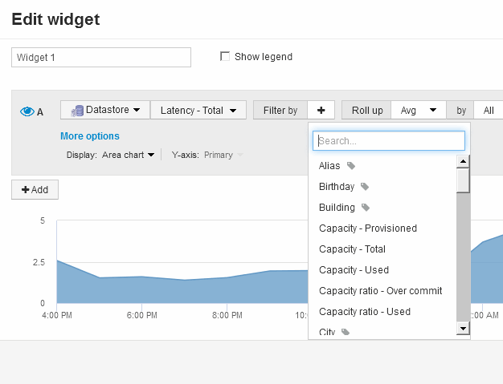

= 대시보드 위젯 쿼리 및 필터
:allow-uri-read: 
:icons: font
:imagesdir: ../media/

[role="lead"]
대시보드 위젯의 쿼리는 데이터 표시를 관리하는 강력한 도구입니다. 다음은 위젯 쿼리에 대해 주의해야 할 몇 가지 사항입니다.

일부 위젯에는 최대 5개의 쿼리가 있을 수 있습니다. 각 쿼리는 위젯에 고유한 선 또는 그래프 세트를 플롯합니다. 한 쿼리에 롤업, 그룹화, 상위/하위 결과 등을 설정해도 위젯에 대한 다른 쿼리에는 영향을 주지 않습니다.

아이 아이콘을 클릭하여 쿼리를 일시적으로 숨길 수 있습니다. 쿼리를 숨기거나 표시하면 위젯이 자동으로 업데이트됩니다. 이렇게 하면 위젯을 구축할 때 개별 쿼리에 대해 표시된 데이터를 확인할 수 있습니다.

다음 위젯 유형에는 여러 개의 쿼리가 있을 수 있습니다.

* 영역형 차트
* 누적 영역형 차트
* 꺾은선형 차트
* 스플라인 차트
* 단일 값 위젯

나머지 위젯 유형에는 하나의 쿼리만 있을 수 있습니다.

* 표
* 가로 막대형 차트
* 상자 플롯
* 산포도

== 대시보드 쿼리에서 필터링

다음 중 하나를 사용하여 필터링하여 쿼리의 * 텍스트 필드 * 에서 검색을 구체화할 수 있습니다.

* 별표를 사용하면 모든 항목을 검색할 수 있습니다. 예를 들면, 다음과 같습니다. `vol*rhel` ""vol""로 시작하고 ""rhel""으로 끝나는 모든 리소스를 표시합니다.
* 물음표를 사용하면 특정 수의 문자를 검색할 수 있습니다. 예를 들면, 다음과 같습니다. `BOS-PRD??-S12` BOS-PRD12-S12, BOS-PRD13-S12 등을 표시합니다.
* 또는 연산자를 사용하여 여러 요소를 지정할 수 있습니다. 예를 들면, 다음과 같습니다. `FAS2240 OR CX600 OR FAS3270` 여러 스토리지 모델을 찾습니다.
* NOT 연산자를 사용하면 검색 결과에서 텍스트를 제외할 수 있습니다. 예를 들면, 다음과 같습니다. `NOT EMC*` "EMC"로 시작하지 않는 모든 항목을 찾습니다. 을 사용할 수 있습니다 `NOT *` null 값을 포함하는 필드를 표시합니다.

필터 문자열을 큰따옴표로 묶으면 Insight는 첫 번째 견적과 마지막 견적 사이의 모든 항목을 정확히 일치하는 것으로 간주합니다. 따옴표 안에 있는 모든 특수 문자나 연산자는 리터럴로 처리됩니다. 예를 들어, "" * "를 필터링하면 리터럴 별표로 된 결과가 반환되고, 이 경우 별표는 와일드카드로 처리되지 않습니다. 연산자 및, 또는 및 는 큰따옴표로 묶으면 리터럴 문자열로 처리됩니다.

== 쿼리 및 필터에 의해 반환된 개체를 식별합니다

쿼리 및 필터에 의해 반환된 개체는 다음 그림에 표시된 개체와 비슷합니다. '태그'가 할당된 개체는 주석이고, 태그가 없는 개체는 성능 카운터 또는 개체 특성입니다.

