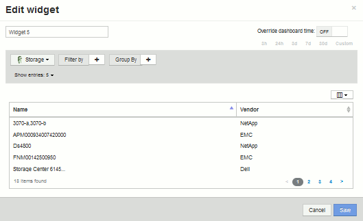
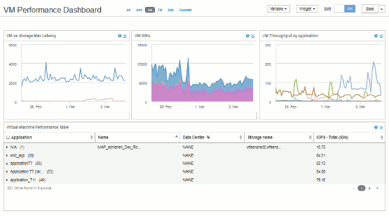

= 사용자 지정 대시보드: 가상 머신 성능
:allow-uri-read: 
:icons: font
:imagesdir: ../media/

[role="lead"]
OnCommand Insight의 맞춤형 대시보드와 위젯은 재고 및 성능 동향을 파악하는 데 도움이 됩니다.

== 이 작업에 대해

오늘날 IT 운영에는 많은 과제가 있습니다. 관리자는 더 적은 리소스로 더 많은 작업을 수행해야 하며, 동적 데이터 센터를 완벽하게 파악할 수 있어야 합니다. 이 예에서는 사용자 환경의 가상 머신 성능에 대한 운영 통찰력을 제공하는 위젯이 포함된 사용자 지정 대시보드를 만드는 방법을 보여 줍니다. 이 예제를 따르고 특정 요구 사항을 충족하기 위한 위젯을 생성하면 프런트엔드 가상 머신(VM) 성능과 비교하여 백엔드 스토리지 성능을 시각적으로 표시하거나, VM 지연 시간과 I/O 요구 사항을 확인할 수 있습니다.

맞춤형 대시보드를 통해 작업의 우선 순위를 지정하고 리소스 가용성을 파악할 수 있습니다. bb 및 워크로드 흐름에 대응하고 새로운 문제를 감지하고 해결하는 시간을 최소화할 수 있습니다. 맞춤형 대시보드를 통해 비즈니스 크리티컬 인프라에 대한 우선 순위 뷰를 유연하게 생성할 수 있으며, 여러 공급업체 기술에서 성능 가용성을 파악하는 데 유용합니다.

여기에서는 다음을 포함하는 Virtual Machine Performance 대시보드를 생성합니다.

* VM 이름 및 성능 데이터가 나열된 표
* VM 지연 시간과 스토리지 지연 시간을 비교한 차트
* VM의 읽기, 쓰기 및 총 IOPS를 보여 주는 차트
* VM의 최대 처리량을 보여 주는 차트입니다

이는 기본적인 예에 불과합니다. 운영 모범 사례를 목표로 선택한 성능 데이터를 강조하고 비교하기 위해 대시보드를 사용자 지정할 수 있습니다.

== 단계

. 관리 권한이 있는 사용자로 Insight에 로그인합니다.
. 대시보드 * 메뉴에서 * + 새 대시보드 * 를 선택합니다.
+
새 대시보드 페이지가 열립니다.

. 대시보드의 이름을 의미 있는 이름으로 지정하겠습니다. 저장 * 을 클릭합니다. 이름 * 필드에 대시보드의 고유 이름(예: ""응용 프로그램별 VM 성능"")을 입력합니다.
. 대시보드를 새 이름으로 저장하려면 * 저장 * 을 클릭합니다.
. 이제 위젯을 추가해 보겠습니다. 필요한 경우 * 편집 * 스위치를 ""켜짐""으로 밀어 편집 모드를 활성화합니다.
. Widget * 버튼을 클릭하고 * Table widget * 을 선택하여 대시보드에 새 테이블 위젯을 추가합니다.
+
위젯 편집 대화 상자가 열립니다. 기본 이름은 ""Widget 1""이며, 표시된 기본 데이터는 사용자 환경의 모든 스토리지에 대한 것입니다.

+

. 이 위젯을 사용자 지정할 수 있습니다. 이름 필드에서 ""Widget 1"을 삭제하고 ""가상 시스템 성능 테이블"을 입력합니다.
. 자산 유형 드롭다운을 클릭하고 * Storage * 를 * Virtual Machine * 으로 변경합니다.
+
테이블 데이터가 변경되어 사용자 환경의 모든 가상 시스템이 표시됩니다. NOW의 경우 테이블에는 VM 이름만 표시됩니다. 표에 몇 개의 열을 추가해 보겠습니다.

. 열 * 을 클릭합니다image:../media/column-picker-button.gif[""] 버튼을 클릭하고 _Data Center_,_스토리지 이름_ 및 _IOPS - 합계_를 선택합니다. 검색에 이름을 입력하여 원하는 필드를 빠르게 표시할 수도 있습니다.
+
이제 이러한 열이 표에 표시됩니다. 이러한 열을 기준으로 테이블을 정렬할 수 있습니다. 열은 위젯에 추가된 순서대로 표시됩니다.

. 이 실습에서는 사용 중이 아닌 VM을 제외하므로 총 IOPS가 10개 미만인 VM을 필터링하겠습니다. Filter by * 옆에 있는 "+" 버튼을 클릭하고 __IOPS - Total (IO/s) __을(를) 선택합니다. 아무 * 나 * 를 클릭하고 * 보내는 사람 * 필드에 ""10""을 입력합니다. 받는 사람 * 필드는 비워 둡니다. 를 클릭합니다 image:../media/check-box-ok.gif[""] 버튼을 눌러 필터를 저장합니다.
+
이제 표에는 총 IOPS가 10개 이상인 VM만 표시됩니다.

. 결과를 그룹화하여 테이블을 더 축소할 수 있습니다. Group By *(그룹화 기준) 옆의 "+" 버튼을 클릭하고 Application(애플리케이션) 또는 Cluster(클러스터) 등 그룹화할 필드를 선택합니다. 그룹화는 자동으로 적용됩니다.
+
이제 설정에 따라 표 행이 그룹화됩니다. 필요에 따라 그룹을 확장하고 축소할 수 있습니다. 그룹화된 행은 각 열에 대해 겹쳐서 표시된 데이터를 표시합니다. 일부 열을 사용하면 해당 열의 롤업 방법을 선택할 수 있습니다.

+
image::../media/custom-dashboard-editwidget-table-populated-5-5.png[사용자 지정 대시보드 편집 위젯 테이블이 채워짐 5 5]

. 표 위젯을 원하는 대로 사용자 정의했으면 * Save * (저장 *) 버튼을 클릭합니다.
+
테이블 위젯이 대시보드에 저장됩니다.

. 오른쪽 아래 모서리를 끌어 대시보드에서 위젯의 크기를 조정할 수 있습니다. 위젯을 더 넓게 만들어 모든 열을 명확하게 표시합니다. Save * 를 클릭하여 현재 대시보드를 저장합니다.
. 다음으로 몇 가지 차트를 추가하여 VM 성능을 보여 드리겠습니다. VM 지연 시간과 스토리지 지연 시간을 비교한 선형 차트를 만들어 보겠습니다.
. 필요한 경우 * 편집 * 스위치를 ""켜짐""으로 밀어 편집 모드를 활성화합니다.
. Widget * 버튼을 클릭하고 * Line Chart * 를 선택하여 대시보드에 새 선형 차트 위젯을 추가합니다.
+
위젯 편집 대화 상자가 열립니다. Name * 필드를 클릭하고 이 위젯 이름을 "'VM vs Storage Max Latency'"로 지정합니다.

. Virtual Machine * 을 선택하고 * Latency-Max * 를 선택합니다. 원하는 필터를 설정하거나 * Filter by * 를 비워 둡니다. Roll Up * 의 경우 "모두"로 "Sum"을 선택합니다. 이 데이터를 ** 꺾은선형 차트**로 표시하고 Y-축을 * 기본 * 으로 둡니다.
. 두 번째 데이터 라인을 추가하려면 * + 추가 * 버튼을 클릭합니다. 이 행에 대해 * 스토리지 * 및 * 지연 시간 - 최대 * 를 선택합니다. 원하는 필터를 설정하거나 * Filter by * 를 비워 둡니다. Roll Up * 의 경우 "모두"로 "Sum"을 선택합니다. 이 데이터를 ** 꺾은선형 차트**로 표시하고 Y-축을 * 기본 * 으로 둡니다.
+
image::../media/customdash-latencywidgetsettings.gif[customdash latencywidgetsettings]

. 이 위젯을 대시보드에 추가하려면 * 저장 * 을 클릭합니다.
. 다음으로 단일 차트에서 VM 읽기, 쓰기 및 총 IOPS를 보여 주는 차트를 추가합니다.
. Widget * 버튼을 클릭하고 * Area Chart * 를 선택하여 대시보드에 새 영역 차트 위젯을 추가합니다.
+
위젯 편집 대화 상자가 열립니다. 이름 * 필드를 클릭하고 이 위젯 이름을 ""VM IOPS""로 지정합니다.

. Virtual Machine * 을 선택하고 * IOPS - Total * 을 선택합니다. 원하는 필터를 설정하거나 * Filter by * 를 비워 둡니다. Roll Up * 의 경우 "모두"로 "Sum"을 선택합니다. 이 데이터를** 면적 도표** 로 표시하고 Y축을 * 기본 * 으로 둡니다.
. 추가 버튼을 클릭하여 두 번째 데이터 라인을 추가합니다. 이 행에 대해 * Virtual Machine * 을 선택하고 * IOPS - 읽기 * 를 선택합니다. Y축을 * 기본 * 으로 놔둡니다.
. 추가 단추를 클릭하여 세 번째 데이터 행을 추가합니다. 이 행에 대해 * Virtual Machine * 을 선택하고 * IOPS-Write * 를 선택합니다. Y축을 * 기본 * 으로 놔둡니다.
+
image::../media/custom-dashboard-vm-iops-chart.gif[사용자 지정 대시보드 VM IOPS 차트]

. 이 위젯을 대시보드에 추가하려면 * 저장 * 을 클릭합니다.
. 다음으로 VM과 연결된 각 애플리케이션의 VM 처리량을 보여 주는 차트를 추가합니다. 이에 대해 롤업 기능을 사용할 것입니다.
. Widget * 버튼을 클릭하고 * Line Chart * 를 선택하여 대시보드에 새 선형 차트 위젯을 추가합니다.
+
위젯 편집 대화 상자가 열립니다. 이름 * 필드를 클릭하고 이 위젯 이름을 ""애플리케이션별 VM 처리량""으로 지정합니다.

. Virtual Machine * 을 선택하고 * Throughput - Total * 을 선택합니다. 원하는 필터를 설정하거나 * Filter by * 를 비워 둡니다. Roll Up * 의 경우 "Max"를 선택하고 "Application" 또는 "Name"을 선택합니다. 상위 10개 * 응용 프로그램을 표시합니다. 이 데이터를 ** 꺾은선형 차트**로 표시하고 Y-축을 * 기본 * 으로 둡니다.
+
image::../media/customdashboard-vmthroughputsettings.gif[대시보드 사용자 지정 vmthroughput을 설정합니다]

. 이 위젯을 대시보드에 추가하려면 * 저장 * 을 클릭합니다.
. 위젯 상단의 아무 곳이나 마우스 버튼을 누른 채 새 위치로 드래그하여 위젯을 이동할 수 있습니다. 오른쪽 아래 모서리를 끌어 위젯 크기를 조정할 수 있습니다. 변경한 후에는 대시보드를 * 저장 * 해야 합니다.
+
최종 VM 성능 대시보드는 다음과 같습니다.

+

