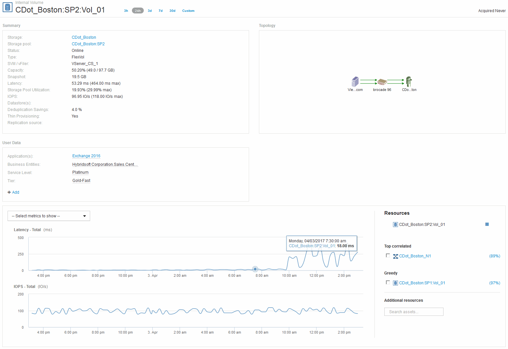

= 내부 볼륨 검사
:allow-uri-read: 
:icons: font
:imagesdir: ../media/

내부 볼륨 랜딩 페이지에는 다음이 표시됩니다.

* 내부 볼륨의 성능 차트는 지연 시간 및 IOPS 측면에서 이전에 볼 수 있었던 애플리케이션 성능 차트와 일치합니다.
* 관련 자산이 표시되는 Resources 섹션에서 ""greedy"" 리소스가 식별됩니다(cDOT_Boston:SP1:Vol_01).

과다 사용 리소스는 통찰력 상관 관계 분석으로 식별됩니다. 욕심/성능 저하 리소스는 동일한 공유 리소스를 활용하는 "피어"입니다. greedy 리소스에는 성능이 저하된 리소스의 IOPS 또는 지연 시간에 부정적인 영향을 주는 IOPS 또는 사용률이 있습니다.

가상 머신, 볼륨 및 내부 볼륨 랜딩 페이지에서 과다 사용 및 성능 저하 리소스를 확인할 수 있습니다. 각 랜딩 페이지에는 최대 2개의 greedy 리소스가 표시됩니다.

상관 순위(%)를 선택하면 greedy 리소스 분석 결과가 제공됩니다. 예를 들어, greedy percentage 값을 클릭하면 다음 예에 표시된 것과 유사하게 Degraded 자산의 작업에 영향을 주는 작업이 식별됩니다.

image::../media/greedy-percentage.gif[greedy 백분율]

성능이 저하된 리소스가 식별되면 성능 저하(%) 점수를 선택하여 성능이 저하된 리소스에 영향을 미치는 작업 및 리소스를 식별할 수 있습니다.

image::../media/guid-13582cf7-aedf-47d1-935e-edc7c5b1b921.gif[GUID 13582cf7 aedf 47d1 935e edc7c5b1b921]
