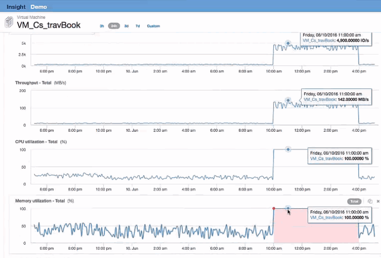

= VM 검사
:allow-uri-read: 
:icons: font
:imagesdir: ../media/

[role="lead"]
VM 랜딩 페이지에서 CPU 사용률 및 메모리 사용률을 표시하고 포함할 추가 메트릭을 선택합니다. CPU 및 메모리 활용도에 대한 그래프는 모두 거의 100%의 용량으로 작동하고 있음을 보여줍니다. 이는 Exchange Server의 문제가 스토리지 문제가 아니라 VM CPU 및 메모리 사용률이 높고 I/O를 디스크로 스왑하는 결과라는 것을 의미합니다.

이 문제를 해결하려면 유사한 리소스를 추가로 찾을 수 있습니다. 추가 리소스 입력 대화 상자에 ""노드""를 입력하여 Exchange VM과 유사한 자산에 대한 메트릭을 표시합니다. 이 비교는 변경이 필요할 경우 워크로드를 호스팅하는 데 더 적합한 노드를 파악하는 데 도움이 될 수 있습니다.

image::../media/resources-vm.gif[리소스 VM]
