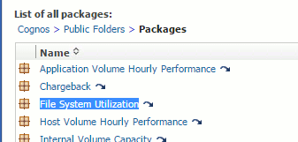

= 파일 시스템 차지백 및 보고
:allow-uri-read: 
:icons: font
:imagesdir: ../media/

[role="lead"]
파일 시스템에 대한 차지백은 항상 스토리지의 관점에서 수행됩니다. 특정 컴퓨팅 리소스 그룹에 대해 주석이 추가된 가상 머신과 연결된 스토리지 스토리지가 해당 리소스 그룹에 대한 차지백 보고서에 포함됩니다.

== 시작하기 전에

파일 시스템 사용률 차지백에 포함하려는 모든 가상 머신에는 적절한 컴퓨팅 리소스 그룹 이름을 주석으로 추가해야 합니다. 이러한 가상 머신과 연결된 스토리지 어레이에는 적절한 계층 주석이 주석으로 첨부되어야 합니다. 데이터 웨어하우스에 대한 ETL은 이러한 주석이 추가된 후에 발생해야 합니다.

== 단계

. 일반적으로 보고 서버에 대한 브라우저를 엽니다 `https://<host or IP>:9300/p2pd``http://<host or IP\>:9300/bi (7.3.3 or later)` 로그인한 다음
. File System Utilization * 패키지를 선택하고 새 보고서를 생성합니다.
+

. 데이터 마트에서 항목을 끌어다 놓아 보고서를 작성합니다.
+
아래 예는 매우 간단한 보고서입니다. 특정 비즈니스 요구 사항에 따라 복잡한 보고서를 작성할 수 있습니다.

+
image::../media/fs-simple-rpt.gif[FS 단순 rpt]

