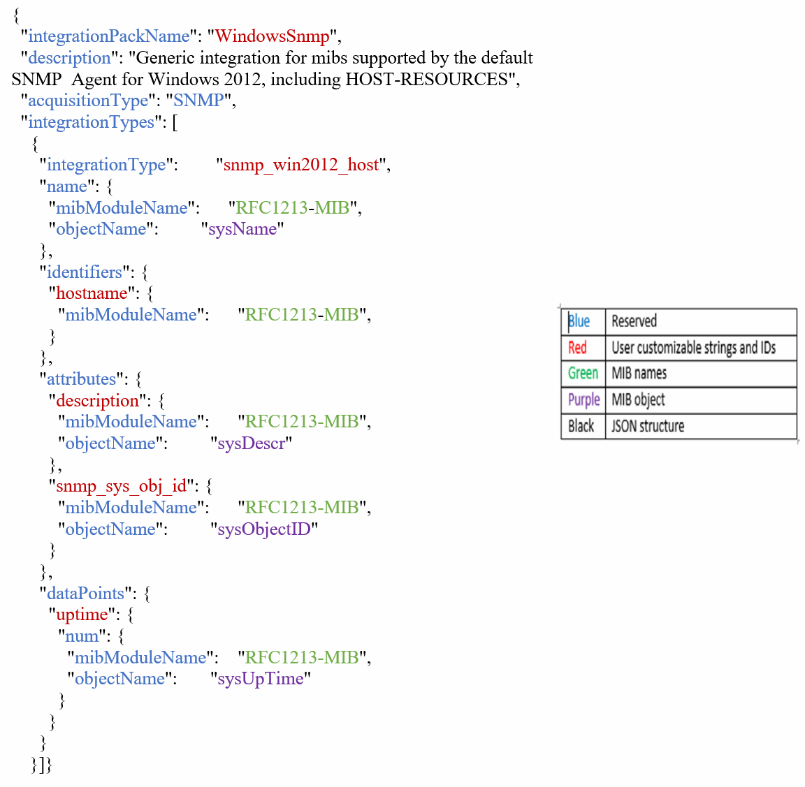

= integration.json 파일 정보
:allow-uri-read: 
:icons: font
:imagesdir: ../media/

[role="lead"]
integration.json 파일은 페이로드를 식별합니다.

다음 그림에서는 간단한 통합 .json 파일의 컬러 코딩 표현을 제공합니다. 첨부 테이블은 파일에 있는 오브젝트의 기능을 식별합니다.

== integration.json 파일 정보

각 필드에는 다음과 같은 특성이 있습니다.

* "식별자" 섹션은 Insight에서 새 "개체"를 만들기 위해 고유한 복합 키를 형성합니다
* "속성"은 객체에 대한 메타 데이터를 지원합니다.
+
이 두 경우 모두 해당 개체에 대한 최신 보고서 값(식별자로 식별)만 보존됩니다.

* "데이터 요소"는 시계열 데이터이며 숫자 값이어야 합니다. Insight는 여기에 보고된 각 값과 모든 값을 기본적으로 90일 동안 유지하고 타임 시리즈를 식별된 개체에 연결합니다.

== 수치 표현식

기본적으로 모든 값 식은 통합 페이로드에서 문자열로 보고됩니다. "식별자" 및 "특성"은 문자열 값만 정의할 수 있습니다. "datapints"는 문자열 또는 숫자 값을 정의할 수 있습니다. 숫자 값은 다음 한정자 키 중 하나를 사용하여 정의됩니다.

* Num - 카운터가 마지막으로 초기화된 이후 수신된 총 바이트 수입니다
* Delta - 폴링 간격 동안 수신된 바이트 수입니다
* 속도 - 폴링 간격 동안의 평균 수신 속도(바이트/초)입니다
+
폴링 간격 동안 초당 메가바이트의 평균 수신 속도는 속도 및 수학 연산의 조합을 사용하여 수행할 수 있습니다

== 수학 연산

를 클릭합니다 `integration.json` 파일에서 지원되는 수학 연산은 더하기, 빼기, 곱하기, 나누기 입니다. 다음 예제에서는 JSON 파일의 곱하기, 나누기 및 합계 작업을 보여 줍니다.

image::../media/net-util-rhel.gif[Net util rhel]

== 키워드

통합 팩 키워드 string은 일반적으로 16진수 형식으로 렌더링되어 ASCII 문자로 렌더링되는 옥텟 문자열이나 옥텟 문자열에서 파생된 독점 형식을 강제로 사용하도록 구현됩니다.

옥텟 문자열에는 대개 바이너리 데이터가 포함됩니다(예: MAC 주소 및 WWN:

[listing]
----
        "interface_mac": {
                  "mibModuleName":      "IF-MIB",
                  "objectName":         "ifPhysAddress"
                 }
----
ifPhysAddress 는 물리주소 유형으로, 옥텟 문자열일 뿐입니다:

[listing]
----
  PhysAddress ::= TEXTUAL-CONVENTION
                DISPLAY-HINT "1x:"
                STATUS       current
                DESCRIPTION
                                "Represents media- or physical-level addresses."
                SYNTAX       OCTET STRING
----
ifPhysAddress 가 기본적으로 16진수로 렌더링되면 결과는 다음과 같습니다.

[listing]
----
"interface_mac": "00:50:56:A2:07:E7"
----
그러나 ASCII로 해석하려는 옥텟 문자열에서 파생된 옥텟 문자열 또는 독점 유형이 있는 경우 "string" 키워드를 사용할 수 있습니다.

[listing]
----
        "string_test_1": {
          "string": {
            "mibModuleName":      "IF-MIB",
            "objectName":         "ifPhysAddress"
          }
        },

        "string_test_2": {
          "string": [
            {
              "mibModuleName":      "IF-MIB",
              "objectName":         "ifPhysAddress"
            },
            {
              "const": "JSD"
            },
            {
              "mibModuleName":      "IF-MIB",
              "objectName":         "ifPhysAddress"
            }
          ]
        }
----
키워드는 기존 문자열 연결 규칙을 따르며 다음 예제에서 용어 사이에 공백을 하나만 삽입합니다.

[listing]
----
      "string_test_1": "PV¢ç",
              "string_test_2": "PV¢ç JSD PV¢ç"
----
"string" 키워드는 단일 용어 또는 용어 목록에 작동하지만 중첩된 식에는 적용되지 않습니다. 중첩 식은 dataPoint 표현식에만 지원됩니다. dataPoint 식에서 "string" 식을 사용하려고 하면 다음과 유사한 오류가 발생합니다.

_java.lang.IllegalArgumentException: 통합 팩 'GenericSwitch32' 인덱스 'snmp_generic_interface_32' 섹션 'ataPoints' 키 'tring_test_3'은 지원되지 않는 JSON 수치 표현식 '{"string":{"mibModuleName":"if-MIB", "ifjectName"}"}' _

DisplayString, SnmpAdminString 등의 일부 파생 옥텟 문자열 형식은 "string" 키워드보다 하드 코딩된 우선 순위를 가집니다. 이는 특히 SnmpAdminString이 UTF-8로 인코딩되어 올바르게 처리하려고 하는 반면 "string" 키워드는 문자당 1바이트 ASCII 코드 포인트를 사용하는 snmp_Framework에서 반환하는 기본 문자열 표현을 강제로 사용하기 때문입니다.
