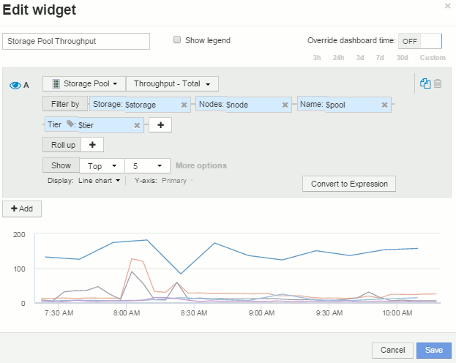

= 노드 대시보드 위젯 설정의 예
:allow-uri-read: 
:icons: font
:imagesdir: ../media/

[role="lead"]
변수 예시가 있는 노드 대시보드의 위젯 설정

다음은 스토리지 노드 대시보드 예에 있는 각 위젯에 대한 설정입니다.

노드 활용률:

image:../media/nodeutilchart.gif[""] image:../media/nodeutiltable.gif[""]

노드 지연 시간:

image:../media/nodelatencychart.gif[""] image:../media/nodelatencytable.gif[""]

스토리지 풀 사용률:

image:../media/poolutilchart.gif[""] image:../media/poolutiltable.gif[""]

스토리지 풀 처리량:

 image:../media/poolthroughputtable.gif[""]

볼륨 지연 시간:

image:../media/vollatencychart.gif[""] image:../media/vollatencytable.gif[""]

볼륨 IOPS:

image:../media/voliopschart.gif[""] image:../media/voliopstable.gif[""]
