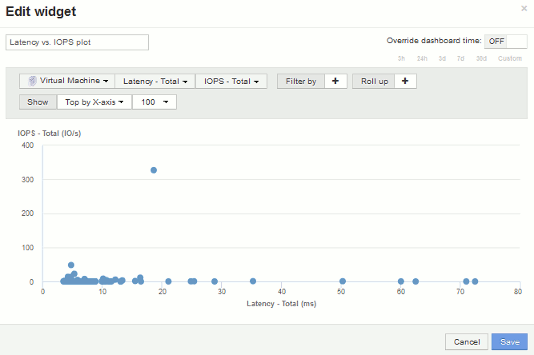

= 산점도 예: 축 이해
:allow-uri-read: 
:icons: font
:imagesdir: ../media/

[role="lead"]
산점도 위젯의 카운터 순서를 변경하면 데이터가 표시되는 축이 변경됩니다.

== 이 작업에 대해

이 예에서는 낮은 IOPS에 비해 지연 시간이 긴 성능 미달 VM을 볼 수 있는 산란 플롯을 작성합니다.

== 단계

. 편집 모드에서 대시보드를 만들거나 열고 * Scatter Plot Chart * 위젯을 추가합니다.
. 자산 유형을 선택합니다(예: * Virtual Machine *).
. 플롯할 첫 번째 카운터를 선택합니다. 이 예에서는 * Latency - Total * 을 선택합니다.
+
_Latency - Total_은 차트의 X축을 따라 차트로 작성됩니다.

. 플롯할 두 번째 카운터를 선택합니다. 이 예에서는 * IOPS - Total * 을 선택합니다.
+
_IOPS - Total_은 차트의 Y축을 따라 차트로 작성됩니다. 지연 시간이 긴 VM은 차트 오른쪽에 표시됩니다. 상위 100개 지연 시간이 가장 긴 VM만 표시됩니다. * X축 기준 상위 * 설정이 최신이기 때문입니다.

+

. 이제 첫 번째 카운터를 * IOPS - Total * 으로 설정하고 두 번째 카운터를 * Latency - Total * 로 설정하여 카운터 순서를 거꾸로 바꿉니다.
+
_Iatency-Total_은 이제 차트의 Y축을 따라 차트로 작성되고 X축을 따라 __IOPS-Tota__l이 작성됩니다. IOPS가 높은 VM이 이제 차트 오른쪽에 표시됩니다.

+
X-Axis * 설정으로 * Top을 변경하지 않았기 때문에 위젯은 현재 X축을 따라 플롯된 것이므로 상위 100개의 가장 높은 IOPS VM을 표시합니다.

+
image::../media/scatterplot2.gif[산란체2]

. 차트에 X축 기준 N 상단, Y축 기준 N 상단, X축 기준 N 하단 또는 Y축 기준 N 하단 을 표시하도록 선택할 수 있습니다. 마지막 예에서는 가장 높은_총 IOPS_를 가진 상위 100개 VM을 표시합니다. Y축을 기준으로 위로 변경하면 차트에 _total latency_가 가장 높은 상위 100개 VM이 다시 표시됩니다.
+
산점도 차트에서 지점을 클릭하여 해당 리소스의 자산 페이지를 열 수 있습니다.

