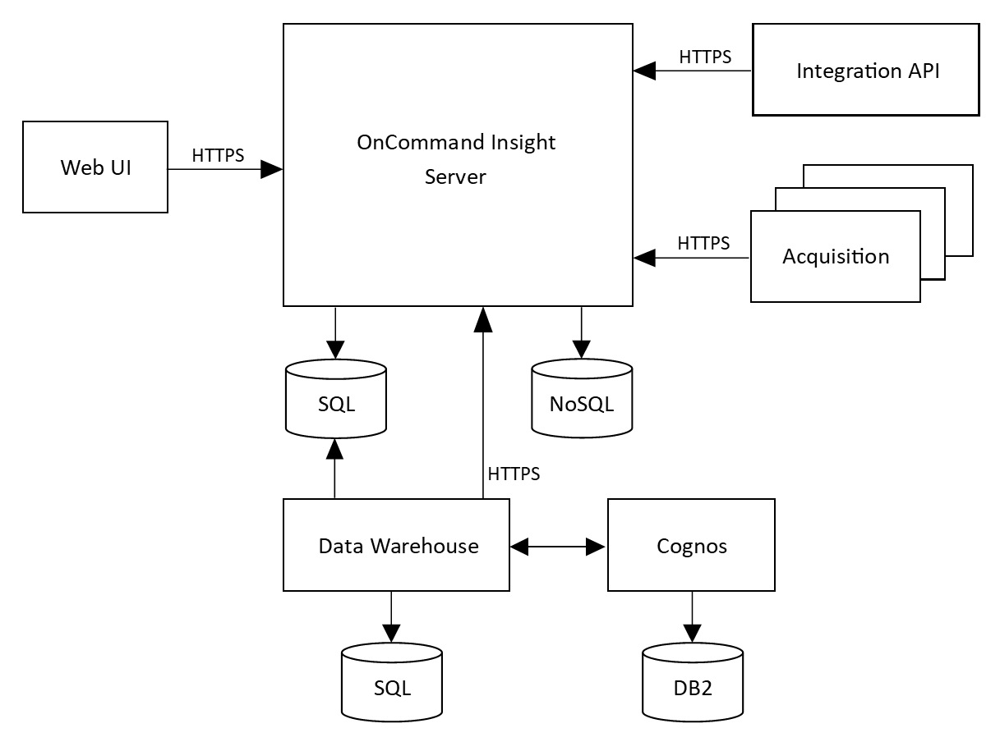

= Insight 아키텍처
:allow-uri-read: 
:icons: font
:imagesdir: ../media/

[role="lead"]
OnCommand Insight의 일반적인 설치에는 웹 기반 UI에서 쉽게 액세스할 수 있는 보고서를 포함한 데이터 수집 및 데이터 웨어하우징이 포함됩니다. 보다 안전한 환경을 위해 원격 획득 장치를 통해 획득을 수행할 수 있습니다.

Insight 아키텍처의 주요 구성 요소는 다음 다이어그램에 나와 있습니다.

* * OnCommand Insight 서버 *
+
OnCommand Insight 서버에는 기본 데이터 저장소 및 분석 구성 요소가 포함되어 있습니다. 서버는 환경의 전체 토폴로지를 지속적으로 구축하고, 환경을 분석하고, 인시던트나 위반이 감지되면 알림을 생성합니다.

* * 취득 *
+
Insight 수집 엔진은 하나 이상의 수집 장치에 구축됩니다. 각 Insight 서버는 로컬 획득 장치를 포함하며 원격 획득 장치를 지원할 수 있습니다. 각 장치는 네트워크에서 실행 중인 서비스로서, 데이터 센터의 장치에서 데이터에 액세스하고 이를 통해 데이터를 수집합니다(_data sources_라고 함). 획득 장치에서 수집한 정보는 분석을 위해 서버로 전송됩니다.

+
수집 엔진은 모듈식으로 쉽게 패치할 수 있도록 설계되었습니다.

* * 통합 API *
+
API를 사용하면 외부 에이전트에서 데이터를 수집할 수 있습니다. 통합 데이터는 쿼리와 위젯을 사용하여 웹 UI에서 볼 수 있습니다. 대시보드에는 '기본' Insight 데이터와 통합 데이터가 포함될 수 있습니다. 이러한 대시보드의 데이터에 필터링, 롤업 및 그룹화를 적용할 수 있습니다.

* 웹 UI *
+
Insight용 HTML5 웹 기반 사용자 인터페이스를 통해 정책, 임계값 및 알림을 비롯한 데이터 소스와 모니터링 환경을 설정할 수 있습니다. 그런 다음 웹 UIAsset 대시보드 및 자산 페이지를 사용하여 잠재적인 문제를 파악하고 조사합니다. 다양한 위젯으로 사용자 지정 대시보드를 만들 수 있습니다. 각 위젯은 데이터를 표시, 분석 및 차트로 매우 유연하게 표시합니다.

* * 데이터 웨어하우스 *
+
OnCommand Insight 데이터 웨어하우스는 여러 Insight 서버의 데이터를 저장하고 쿼리 및 분석을 위한 공통의 다차원 데이터 모델로 데이터를 변환하는 중앙 집중식 저장소입니다.

+
OnCommand Insight 데이터 웨어하우스를 사용하면 지불 거절 보고서, 내역 데이터가 포함된 추세 보고서, 소비 분석 및 예측 보고서와 같은 사용자 정의 용량 및 성능 보고서를 생성할 수 있는 여러 데이터 마트로 구성된 공개 데이터베이스에 액세스할 수 있습니다.

+
데이터 웨어하우스는 하나 또는 여러 개의 Insight 설치를 위한 보고 데이터를 통합하고 준비합니다. 이 데이터에는 데이터 센터 인프라에 대한 장기 계획을 지원하기 위한 기록, 추세 분석, 인벤토리, 차지백, 표시 및 데이터 프레젠테이션이 포함됩니다.

* * Cognos *
+
Cognos는 미리 정의된 보고서를 보거나 사용자 지정 보고서를 만들 수 있는 IBM 비즈니스 인텔리전스 도구인 Insight의 보고 엔진입니다. Insight Reporting은 데이터 웨어하우스 데이터에서 보고서를 생성합니다.

