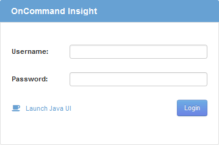

= 웹 UI 액세스
:allow-uri-read: 
:icons: font
:imagesdir: ../media/

[role="lead"]
OnCommand Insight를 설치한 후에는 라이센스를 설치한 다음 환경을 모니터링할 Insight를 설정해야 합니다. 웹 브라우저를 사용하여 Insight 웹 UI에 액세스하면 됩니다.

== 단계

. 다음 중 하나를 수행합니다.
+
** Insight 서버에 대한 Insight를 엽니다.
+
`+https://fqdn+`

** 다른 위치에서 Insight 열기:
+
`+https://fqdn:port+`

+
포트 번호는 Insight 서버를 설치할 때 구성된 443 또는 다른 포트입니다. URL에서 포트 번호를 지정하지 않으면 포트 번호는 443으로 기본 설정됩니다.

+
OnCommand Insight 대화 상자가 표시됩니다.

. 사용자 이름과 암호를 입력하고 * 로그인 * 을 클릭합니다.
+
라이센스가 설치된 경우 데이터 소스 설정 페이지가 표시됩니다.

+
[NOTE]
====
30분 동안 비활성 상태인 Insight 브라우저 세션이 시간 초과되고 시스템에서 자동으로 로그아웃됩니다. 보안 강화를 위해 Insight에서 로그아웃한 후 브라우저를 닫는 것이 좋습니다.

====

