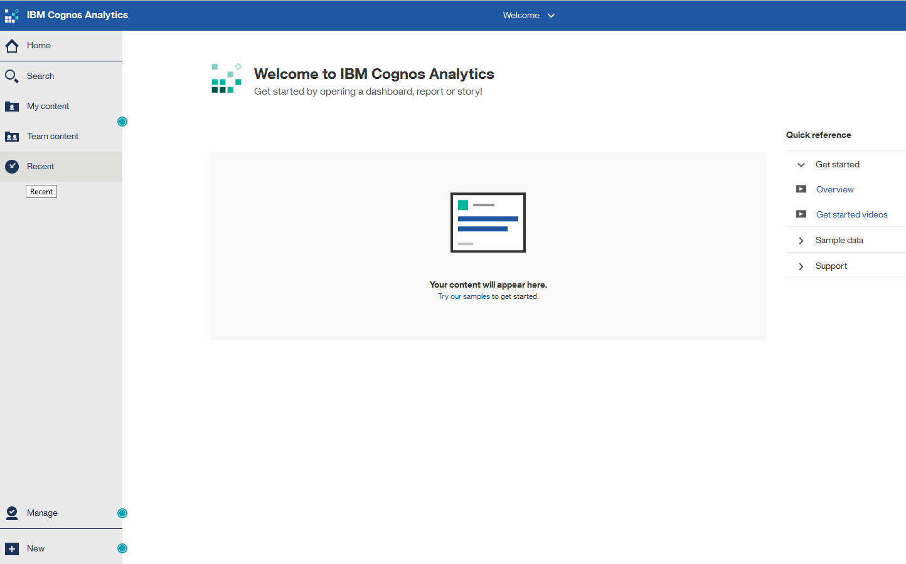

= OnCommand Insight 보고 포털 액세스
:allow-uri-read: 
:icons: font
:imagesdir: ../media/

[role="lead"]
웹 브라우저, 데이터 웨어하우스 또는 Insight 서버에서 직접 OnCommand Insight 보고 포털에 액세스할 수 있습니다. 보고 포털을 사용하여 미리 정의된 보고서에 액세스하거나 데이터 웨어하우스 데이터를 사용하여 고유한 보고서를 만들 수 있습니다.

== 웹 브라우저에서 보고 포털에 액세스합니다

=== 단계

. 웹 브라우저를 엽니다.
. 다음 URL을 입력합니다. `+https://server-name:9300/bi+`
+
9300은 설치 중에 지정된 기본 포트를 나타냅니다. 다른 포트를 지정한 경우 포트를 변경해야 합니다.

. 사용자 이름과 암호를 입력한 다음 * 확인 * 을 클릭합니다.

== Insight 서버에서 보고 포털에 액세스

=== 단계

. 웹 브라우저를 엽니다.
. Insight 서버에 액세스하려면 다음 URL을 입력하십시오. `+https://server-name+`
. 사용자 이름과 암호를 입력한 다음 * 확인 * 을 클릭합니다.
. Insight 도구 모음에서 를 클릭합니다 image:../media/oci-reporting-portal-icon.gif[""].
. 나타나는 로그인 페이지에서 사용자 이름과 암호를 입력한 다음 * 확인 * 을 클릭합니다.

== 데이터 웨어하우스에서 보고 포털에 액세스

=== 단계

. 웹 브라우저를 엽니다.
. 데이터 웨어하우스에 액세스하려면 다음 URL을 입력하십시오. `+https://server-name/dwh+`
. 사용자 이름과 암호를 입력한 다음 * 확인 * 을 클릭합니다.
. 데이터 웨어하우스 도구 모음에서 를 클릭합니다 image:../media/oci-reporting-portal-icon.gif[""].
. 나타나는 로그인 페이지에서 사용자 이름과 암호를 입력한 다음 * 확인 * 을 클릭합니다.

=== 결과

IBM Cognos Analytics 시작 페이지가 표시됩니다. 이 페이지는 OnCommand Insight 보고 포털의 기본 랜딩 페이지입니다.

