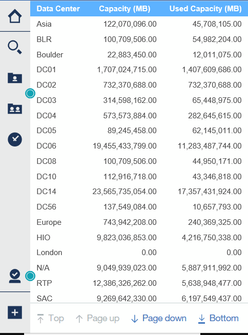

= Cognos 11을 사용하여 보고서 만들기
:allow-uri-read: 
:icons: font
:imagesdir: ../media/

[role="lead"]
Cognos 11을 사용하여 보고서를 만드는 것은 이전 버전의 Cognos와 다릅니다. 이 절차를 사용하여 미리 정의된 OnCommand Insight 보고서를 사용하여 보고서를 만들 수 있습니다.

== 이 작업에 대해

다음 단계를 수행하여 여러 데이터 센터에 있는 스토리지 및 스토리지 풀의 물리적 용량에 대한 간단한 보고서를 생성할 수 있습니다.

== 단계

. 도구 모음에서 를 클릭합니다 image:../media/new-report.gif[""]
. 보고서 * 를 클릭합니다
. 템플릿 * > * 공백 * 을 클릭합니다
. 테마 * > * 쿨 블루 * > * 확인 * 을 클릭합니다
+
소스 및 데이터 탭이 표시됩니다

. 소스 * > * 를 클릭합니다image:../media/new-report.gif[""]*
. 파일 열기 대화 상자에서 * 팀 컨텐츠 * > * 패키지 * 를 클릭합니다
+
사용 가능한 패키지 목록이 표시됩니다.

. 스토리지 및 스토리지 풀 용량 * > * 열기 * 를 클릭합니다
. 을 클릭합니다 image:../media/new-report.gif[""]
+
보고서에 사용할 수 있는 스타일이 표시됩니다.

. 목록 * 을 클릭합니다
+
목록 및 쿼리에 적절한 이름을 추가합니다

. 확인 * 을 클릭합니다
. 물리적 용량 * 을 확장합니다
. 가장 낮은 수준의 * 데이터 센터 * 로 확장합니다
. 끌기 image:../media/data-center.gif[""] 보고 미각을 표시합니다.
. 용량(MB) * 을 확장합니다
. 용량(MB) * 을 보고 입천장에 끌어다 놓습니다.
. Used Capacity(MB) * 를 Reporting palate(보고 구개)로 끌어다 놓습니다.
. 를 클릭하여 보고서를 실행합니다 image:../media/run-report.gif[""] 출력 유형을 선택합니다.

== 결과

다음과 유사한 보고서가 생성됩니다.

